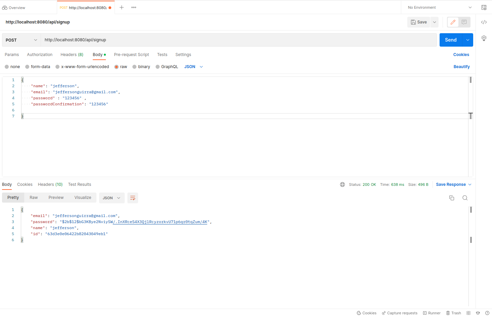

<h1 align="center">
  SignUp Api
</h1>
<p align="center">
  <a href="https://expressjs.com/pt-br/" target="blank"></a>
</p>

## Description

[express](https://github.com/expressjs) framework TypeScript starter repository.

## Instalation

```bash
$ npm run install

```
## running app

### development
```bash
$ npm start
```

### watch mode
```bash
$ npm start:dev
```

## Test

### Unit Test
```bash
$ npm run test:unit
```
### Integration Test
```bash
$ npm run test:integration
```
### Covarege Test
```bash
$ npm run test:ci
```
